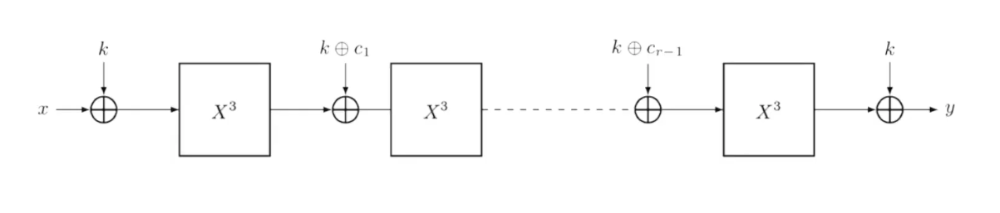

# MiMC hashing implemented in circom

MiMC is a block cipher and hash function family designed specifically for SNARK applications. The low multiplicative complexity of MiMC over prime fields makes it suitable for zk-SNARK applications such as ZCash.



### NOTE: We are implementing x^5 instead of x^3

Pre-Requisite

1. Circom2.0 should be installed.
2. snarkjs should be installed.

Navigate to the root of the project directory in your terminal and do

```bash
npm install
```

Run these commands in order

1. To compile the circuit

```bash
circom circuit.circom --r1cs --wasm
```

2. To run the circuit

```bash
node ./circuit_js/generate_witness.js ./circuit_js/circuit.wasm input.json witness.wtns
```

3. To run the utility

```bash
snarkjs wtns export json witness.wtns witness.json
```
